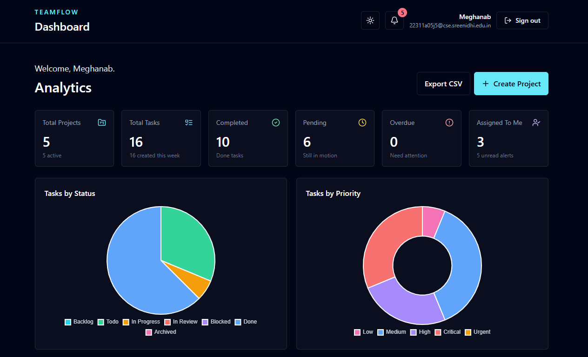
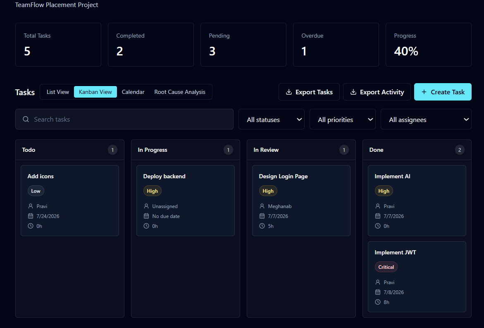
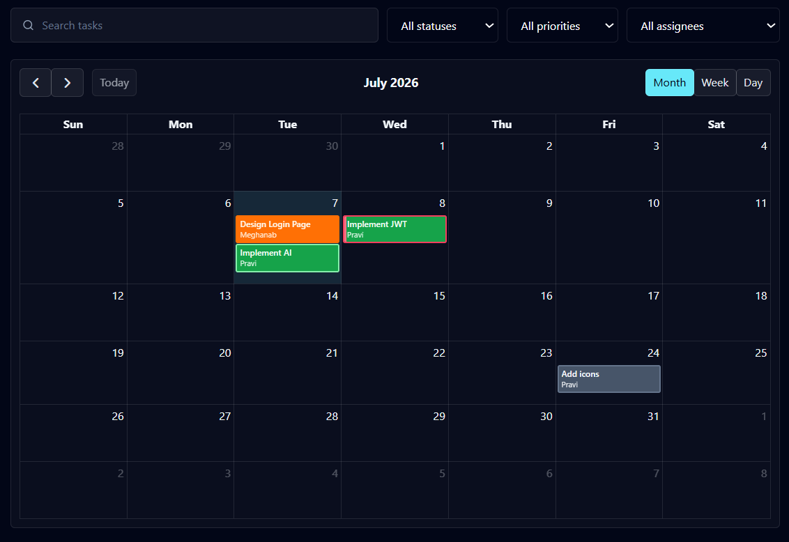
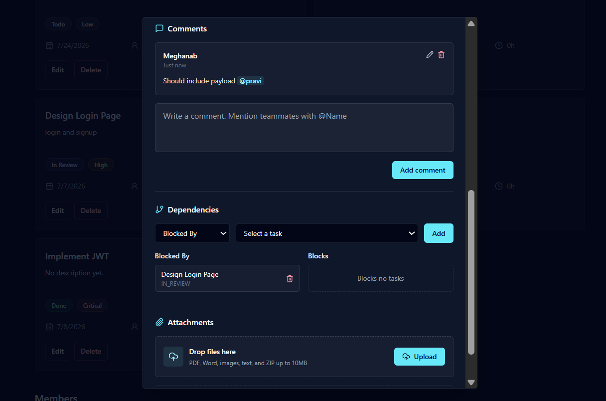
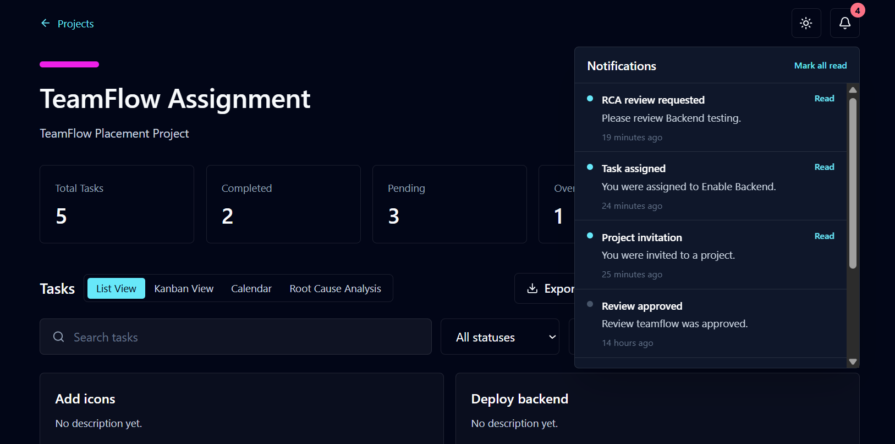
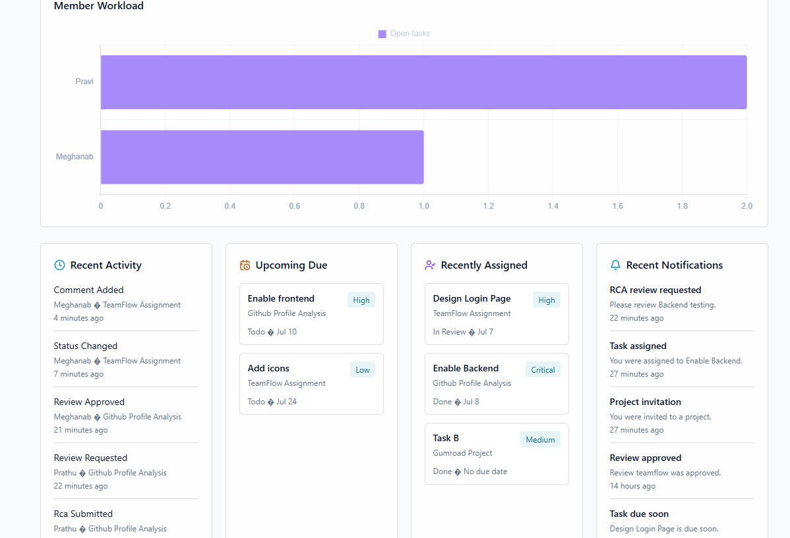

# 🚀 TeamFlow

A modern full-stack collaborative project management platform built with **React, TypeScript, Node.js, Express, Prisma and PostgreSQL**.

TeamFlow helps teams manage projects efficiently through Kanban boards, calendars, analytics, task dependencies, comments, notifications, attachments, Root Cause Analysis (RCA), and much more.

---

## ✨ Features

### 📁 Project Management
- Create, edit and delete projects
- Invite and manage project members
- Role-based access (Owner/Admin/Member)
- Project analytics dashboard

### ✅ Task Management
- Create, edit and delete tasks
- Priority & status management
- Due dates and estimated hours
- Assignee management
- Drag-and-drop Kanban board
- Calendar view
- Task dependencies
- Dependency validation
- Warning for unfinished blockers

### 💬 Collaboration
- Task comments
- User mentions (@username)
- Activity timeline
- Real-time style notifications
- Email notifications

### 📎 Attachments
- Upload documents
- Download attachments
- Delete attachments
- File validation

### 📊 Dashboard
- Project overview
- Task statistics
- Priority distribution
- Due date insights
- Productivity charts

### 📄 Root Cause Analysis (RCA)
- RCA creation
- Review workflow
- Reviewer assignment
- Approval / Rejection process

### 📤 Export
- Export Projects CSV
- Export Tasks CSV
- Export Activity CSV

### 🎨 User Experience
- Responsive UI
- Dark / Light theme
- Toast notifications
- Modern dashboard
- Mobile-friendly layout

---

# 📸 Screenshots

## Dashboard



---

## Kanban Board



---

## Calendar View



---

## Task Details (Comments • Dependencies • Attachments)



---

## Notifications



---

## Light Theme



---

# 🛠️ Tech Stack

### Frontend

- React
- TypeScript
- Vite
- Tailwind CSS
- React Hook Form
- React Router
- React Beautiful DnD

### Backend

- Node.js
- Express.js
- TypeScript
- Prisma ORM

### Database

- PostgreSQL

### Authentication

- JWT Authentication
- Protected Routes

### Other Tools

- Nodemailer
- PapaParse
- Multer
- Zod
- bcrypt

---

# 📂 Project Structure

```
TeamFlow
│
├── frontend
│   ├── src
│   ├── components
│   ├── pages
│   └── features
│
├── backend
│   ├── src
│   ├── modules
│   ├── prisma
│   └── uploads
│
├── screenshots
│
└── README.md
```

---

# ⚙️ Installation

## Clone Repository

```bash
git clone https://github.com/mmeeghana/TeamFlow.git
cd TeamFlow
```

---

## Install Dependencies

```bash
npm install
```

---

## Backend

```bash
cd backend
npm install
```

Create a `.env`

```
DATABASE_URL=
JWT_SECRET=
SMTP_HOST=
SMTP_PORT=
SMTP_USER=
SMTP_PASS=
```

Run Prisma

```bash
npx prisma migrate dev
npx prisma generate
```

Start backend

```bash
npm run dev
```

---

## Frontend

```bash
cd frontend
npm install
npm run dev
```

Application

```
Frontend
http://localhost:5173

Backend
http://localhost:3000
```

---

# 📊 Modules Implemented

- ✅ Authentication
- ✅ Dashboard
- ✅ Project Management
- ✅ Task Management
- ✅ Kanban Board
- ✅ Calendar View
- ✅ Activity Timeline
- ✅ Comments
- ✅ Notifications
- ✅ Attachments
- ✅ Task Dependencies
- ✅ Root Cause Analysis
- ✅ Review Workflow
- ✅ CSV Export
- ✅ Dark / Light Theme

---

# 🔒 Security

- JWT Authentication
- Password Hashing
- Protected APIs
- Role-based Authorization
- Request Validation using Zod

---

# 🚀 Future Improvements

- Real-time collaboration using WebSockets
- Slack / Teams integration
- Advanced reporting
- Gantt charts
- Mobile application
- Push notifications

---

# 👩‍💻 Author

**Meghana Batchalakuri**

GitHub: https://github.com/mmeeghana

